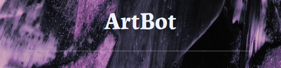

# Artbot

_A simple art prompt generator chatbot._

## Objective
An interactive computer program designed to generate drawing and painting prompts for users. It uses natural language processing to understand user input and generate prompts based on predefined categories or topics. It provides a fun and engaging way for users to generate new and exciting drawing ideas, making it a useful tool for artists and creative professionals. 

## Data
The chatbot has been trained using a structured data file containing possible user queries and appropriate responses grouped into different categories. It has been taught to respond to a variety of user inputs in a natural and intuitive way. In as much as I compiled the dataset myself, I sourced the data from different websites that offer free drawing and painting prompts. However, the data does not cover all possible categories of art prompts.

## Tools and Libraries
| Name | Description |
| ------------------------------ | -------------------------------------------- |
| numpy | Array management. |
| tensorflow | Develop and train NLP model. |
| tflearn | Text classification, developing and training Deep Neural Networks. |
| pickle | Saving processed data. |
| nltk | Tokenization and Named Entity Recognition |
| flask | Web interface. |

## Usage
User asks the bot for a prompt related to a specific topic and the bot returns an appropriate art prompt.
Access it here: https://art-prompt-chatbot.herokuapp.com/

## Further Development
The chatbot may be further developed to use machine learning algorithms to improve its prompt generation capabilities over time by learning from user feedback.  It may also incorporate image data and OCR technology to analyze and extract text from images, allowing users to input their own images as prompts.

## Author
##### Mary Wachiuri
I'm a data scientist as well as an artist. As this was my first NLP project, my aim was to create something fun, creative and functional.
